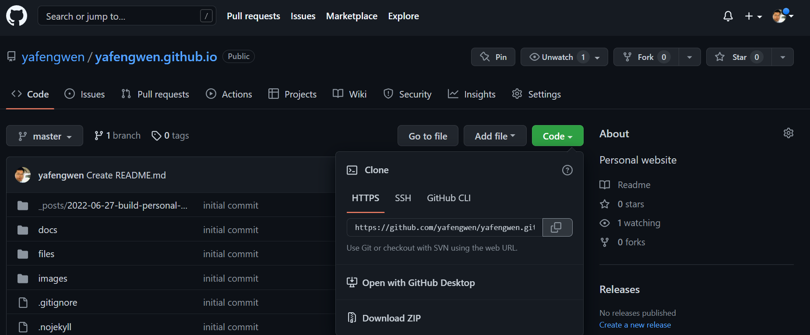
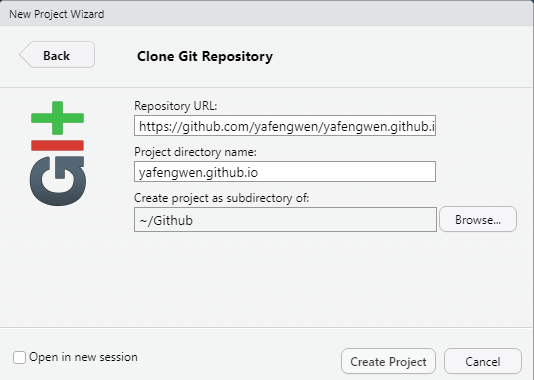
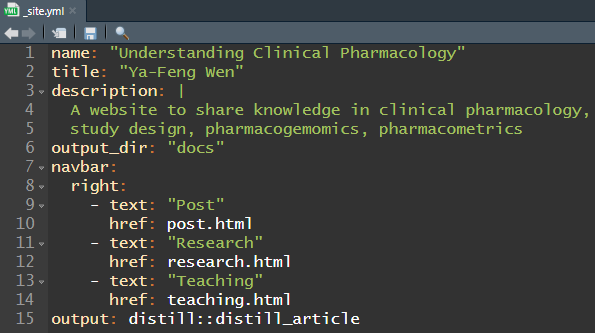
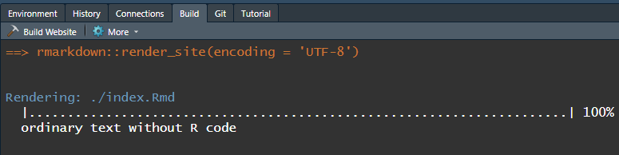
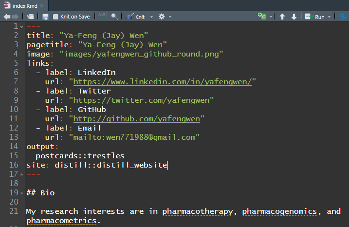
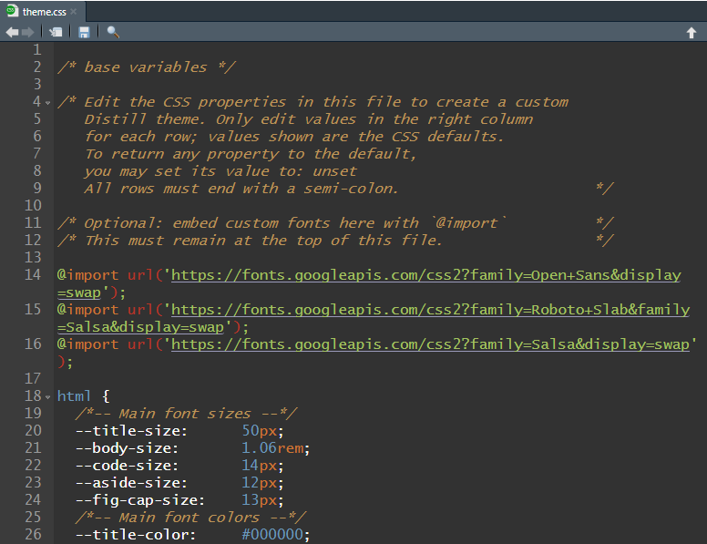
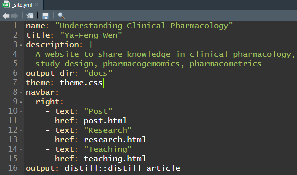
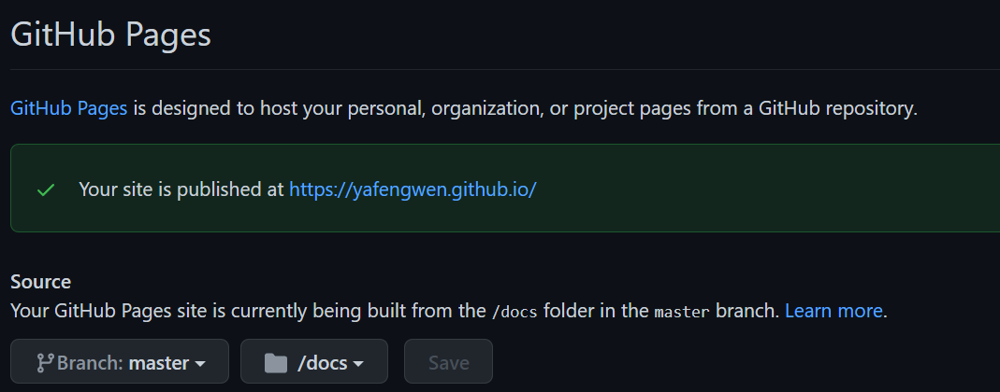

```{r setup, include=FALSE}
knitr::opts_chunk$set(
  echo = TRUE, eval = FALSE
  )
```

There are several R packages available to build a personal website with ease and aesthetic, including [blogdown](https://pkgs.rstudio.com/blogdown/), [postcards](https://github.com/seankross/postcards) and [Distill](https://rstudio.github.io/distill/). Once the website is built, it can be easily hosted on the [GitHub](https://pages.github.com/) or [Netlify](https://www.netlify.com/?utm_medium=ppc&utm_source=google&utm_campaign=DSA-Nonbrand-MaxC-US) for free. This post will demonstrate how to build a personal website with a personal home page using `postcards`, blog posts and articles with `Distill`, and host such website on GitHub. The workflow is largely referenced from two sources: 1) the workshop on "[Introduce yourself online](https://www.apreshill.com/talk/2021-rstudio-global/)" by Alison Hill and 2) "[Building websites in RStudio](https://www.youtube.com/watch?v=RYf5HqU1pI4)" by Maria Tackett hosted by R-Ladies Baltimore (The github repo for this talk can be found [here](https://github.com/matackett/rladies-build-websites)).

### Steps overview

1. Create a github repo for personal website
2. Use `Distill` to create a **Distill blog** 
3. Restart project and Build website
4. Use `postcards` to create a personal landing page
5. Create a personal theme CSS if needed
6. Create posts 
7. Deploy the site on GitHub and repeat step 6 and 7

### Steps in detail

1. Create a github repo for personal website



- The repo name needs to contain **github.io**
- The repo name will be the URL for the website (can change later)
- Edit "About" section so others (including yourself) know the purpose of this repo easily
- Clone the repo by copying the HTTPS URL
- Start a new RStudio project --> Version Control --> Clone Git Repository --> Paste the Repository URL --> Create Project



2. Use `Distill` to create a **Distill blog** 

```{r, eval=FALSE}
# install.packages("distill")
library(distill)

# gh_pages, configure the site for publishing using GitHub Pages
create_blog(dir = ".", title = "Personal Website", gh_pages = TRUE) 
```




* _site.yml: Website configuration file
  * output_dir: "docs": The *docs* folder contains all the components for the website which will be used when deploy the website on GitHub. 
  * navbar: Navigation bar at the top of page
  * text: Text displayed in navigation bar
  * href: (Relative) link to the page in the *docs* folder
* index.Rmd: Homepage for the website (will be replaced with the `postcards` page in the next step)

Note that you can also choose to create a **Distill website**. 

The difference between blog and website is explained in the [introduction](https://rstudio.github.io/distill/website.html) of the `Distill` package. Basically, a *website* is a collection of pages (be created with Distill Article) and a *blog* is a website with a special page called "listing page" to collect blog posts and display key metadata (such as publication date, author, title, categories, etc. in the YAML of a Rmarkdown file). In addition, using a **Distill blog** structure prevents re-rendering of each post when the site is rebuilt so that when certain R packages got updated, these post created with older version can still be displayed properly. On the other hand, using  a **Distill website** structure, *website* pages and root pages of *blogs* are re-rendered when the site is rebuilt. 

3. Restart project and Build website

Restart project so this project can be recognized as a website. Then use the *Build Website* to build the website locally. 



4. Use `postcards` to create a personal landing page

Create a Hugo Academic like homepage using the "trestles" template in `postcards`. Modify the content as see fit.

```{r}
# install.packages("postcards")
create_article(file = "index", template = "trestles", package = "postcards")

# alternatively
postcards::create_postcard(file = "index.Rmd", template = "trestles")
```

 

5. Create a personal *blog* theme if needed

```{r}
# apply the theme to entire website
create_theme("theme")
```

Make sure to include customized *theme* in _site.yml so the effect will be applied to the entire website. 



Detail information on customizing the theme CSS file can be found under the [Theming](https://rstudio.github.io/distill/website.html?panelset=themed-site#theming) section of the `Distill` package website. 

6. Create post

```{r}
create_post(title = "First post", 
            author = "Ya-Feng Wen", 
            date = Sys.Date())
```

This create a sub folder under **_posts** folder for each post.

7. Deploy the site on GitHub

- Push all the update files to GitHub
- Under *Settings* find the *Pages* on the left hand navigation bar. This will show the configuration for the GitHub Pages. Change the Source to /docs which contains all the necessary components for the website. 



### Congratulations to have a personal website!