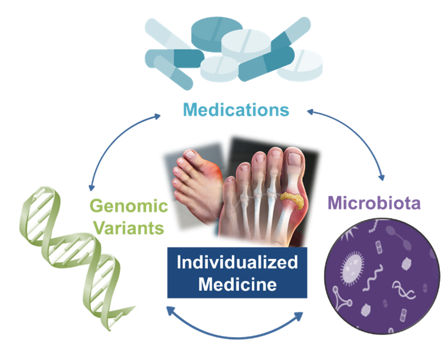

```{r setup, include=FALSE}
knitr::opts_chunk$set(echo = FALSE)
```



<br />

**The central goal** of my research is to develop an individualized strategy to combine knowledge of host characteristic (e.g., genomics and microbiota) and individual factors (e.g., co-morbidities, co-administered medications, diet, etc.) to reduce cardiovascular (CV) diseases and its related comorbidities. This strategy is expected to positively impact the severity of illness, mortality and healthcare costs for those with gout and potentially patients with many other related diseases. 

<br />

My thesis projects include: 

[Project 1: Identify and quantify the impact of common and novel single nucleotide polymorphisms (SNPs) within very important pharmacogenes (VIPs)](#topic-1) 

[Project 2: Develop a genotype-guided strategy for dose selection of allopurinol to increase attainment of goal serum urate (SU)](#topic-1)  

[Project 3: Examine the association between genetic variants and SU-lowering effects of fenofibrate](#topic-1) 

[Project 4: Quantitatively examine how the microbiome profiles differ between healthy adults and patients receiving urate-lowering therapies (ULTs)](#topic-1)  


<a name="topic-1">__Project 1__</a>

We have found important differences in allele frequencies for key SNPs (including _HLA-B\*58:01, CYP2C9\*3A, CYP2C19\*2, CYP2C19\*3, CYP4F2\*3_, and _SLCO1B1\*5_) influencing selection of medications and dosages were found between the Hmong and East Asians. [2,4,12,14] These findings suggest different predicted warfarin dosing requirements and different HLA testing approaches between Hmong and East Asians. [1,4] The Hmong community have, in general, a positive attitude towards pharmacogenomics (PGx) testing. [3,13] We are currently conducting a separate focus group to gain more insights about the community’s perception on the utility and interpretation of PGx testing in mental health diseases. [7,11] To identify potential novel SNPs, we sequenced 286 pharmacogenes using next-generation sequencing. Using the current informatics tools, such as Astrolabe, we are working to translate our genotypic findings into clinically actionable information. Our current focus is on next generation sequencing of CYP2D6 in Hmong [6], and future goal will expand to other genes that are pertinent to gout and cardiovascular medications.

<a name="topic-2">__Project 2__</a>

Objective 2: We first determine if genetic variants affect the selection and use of ULT in patients with gout and/or hyperuricemia. This will be accomplished by our comprehensive systematic literature review. [9] We are also constructing a pharmacokinetic and pharmacodynamic model to evaluate patient factors, including renal function, weight, diuretic use, and SNPs on dose prediction of allopurinol to achieve target SU. [5] 

<a name="topic-3">__Project 3__</a>

Objective 3: An alternative medication is required for patients with gout who cannot safely use allopurinol or are predicted poor responders. Fenofibrate represents a potential alternative that lowers SU, triglycerides and raises HDL-C, thereby reducing the risk of gout and cardiovascular disease. Genetic variants that modulate the triglyceride-lowering effect of fenofibrate, have not been studied on fenofibrate’s impact on SU-lowering response. My project is to conduct a genome-wide association study to identify genetic variants that are implicated in the SU-lowering response of fenofibrate.

<a name="topic-4">__Project 4__</a>

Objective 4: Certain bacteria in the gut may impact the uric acid production leading to the development of hyperuricemia. We are conducting a pilot study involving 180 Hmong adults to test whether vitamin C can be used as an alternative SU-lowering agent and whether different gut microbiome profiles will have impact on its efficacy. This funded study is currently under review by UMN IRB. We expect to initiate the study in 2021 and complete interim analysis by the end of 2021.


<br />
<br />

## Selected publications

#### Peer-Reviewed Publications

1.	Sun B, **Wen YF**, Culhane-Pera KA, Thyagarajan B, Bishop J, Zierhut H, Muaj Lo M, Xiong T, Peng K, Holzer K, Lee K, and Straka RJ. Differences in predicted warfarin dosing requirements between Hmong and East Asians using a genotype-based dosing algorithm. Pharmacotherapy. 2020. [Epub ahead of print] PMID: 33202062.
2.	**Wen YF**, Culhane-Pera KA, Thyagarajan B, Bishop J, Zierhut H, Muaj Lo M, Xiong T, Peng K, Holzer K, Lee K, and Straka RJ. Differences in Allele Frequency between Minnesota Hmong and East Asian Population in Key Genetic Variants within Very Important Pharmacogenes (VIPs). Pharmacotherapy 2020;40(2):142-52. Epub 2019/12/31.
3.	Holzer K, Culhane-Pera KA, Straka RJ, **Wen YF**, Lo M, Lee K, Xiong T, Peng K, Bishop J, Thyagarajan B, HA Zierhut. Hmong participants’ reactions to return of individual and community pharmacogenetic research results: “A positive light for our community”. Journal of community genetics. 2020. https://doi.org/10.1007/s12687-020-00475-3
4.	Peng K, Bjork J, **Wen YF**, Roman YM, Culhane-Pera K, Lo M, Gertner E, Straka RJ. HLA -B*58:01 Carrier Status in the Minnesota Hmong: First in Hmong Genotyping for Prevalence of this Biomarker of Risk for Severe Cutaneous Adverse Reactions (SCARs) Caused by Allopurinol. Pharmacogenet Genomics. 2019 Oct 25. https://doi:10.1097/FPC.0000000000000391.

#### Abstracts (Podium and Poster Presentation)

5.	**Wen YF**, Brundage R, Straka RJ. The Impact of SLC22A12 Genotype on Pharmacokinetics and Pharmacodynamics of Allopurinol in Hmong with Gout and/or Hyperuricemia. November 9-13, 2020. American Conference on Pharmacometrics 11, Virtual. Poster THU-070. (Full manuscript in progress)
6.	**Wen YF**, Gaedigk A, Boone E, Wang W, Straka RJ. Genetic variation of CYP2D6 in US Hmong, an Underserved Community. October 26, 2020. Pharmacogenomics Research Network Conference, Virtual. Poster 52. (Full manuscript in progress)
7.	Nelson JM, **Wen YF**, Culhan-Pera KA, Lo M, Xiong T, Lee K, Peng K, Thyagarajan B, Bishop J, Zierhut H, Straka RJ. Pharmacogenomics as a guide to improve antidepressant drug selection and dosing in the Minnesota Hmong. October 24-27, 2020. American College of Clinical Pharmacy Annual Meeting, Virtual.
8.	Prizment A, Church TR, Hatsukami D, Madoff R, Staley C, Straka RJ, Iwan A, Stromberg J, **Wen YF**, Stibbe C, Rahne M. Pilot trial to examine the effect of ginger on the gut microbiome: The Minnesota Cancer Clinical Trials Network [abstract]. In: Proceedings of the AACR Special Conference on Modernizing Population Sciences in the Digital Age; 2019 Feb 19-22; San Diego, CA. Philadelphia (PA): AACR; Cancer Epidemiol Biomarkers Prev 2020;29(9 Suppl):Abstract nr A26.
9.	**Wen YF**, Sayre F, Nelson J, Straka RJ. Systematic review of genetic factors related to the selection and use of urate lowering therapy in patients with gout and/or hyperuricemia. In Clinical Pharmacology & Therapeutics (vol. 107, pp. s21-s22). 111 River St, Hoboken 07030-5774, NJ USA: Wiley.
10.	Sun B, **Wen YF**, Culhane-Pera KA, Straka RJ. Differences in predicted warfarin dosing requirements for Hmong vs East Asians using a genotype-based dosing algorithm. (abstract presented at 2019 American College of Clinical Pharmacy Annual Meeting, New York, NY)
11.	Nelson JM, **Wen YF**, Straka RJ. Pharmacogenomics as a guide to improve psychiatric drug selection and dosing in the Minnesota Hmong. September 16, 2019 CTSI URP & ARP Poster Session, University of Minnesota, Minneapolis, MN. 
12.	Culhane-Pera KA, **Wen YF**. Pharmacogentic differences between Hmong and East Asians Populations. March 2, 2019 Minnesota Academy of Family Physicians, 2019 Innovation & Research Forum, Bloomington, MN. (Podium Presentation, selected as one of three Projects of Greatest Interest)
13.	Xiong T, Holzer K, Lee K, Peng K, Xiong S, Zierhut H, Thyagarajan B, Bishop J, **Wen YF**, Straka RJ. Hmong Research Participants’ Reactions to Their Pharmacogenetic Results. March 2, 2019 Minnesota Academy of Family Physicians, 2019 Innovation & Research Forum, Bloomington, MN.
14.	**Wen YF**, Culhane-Pera KA, Thyagarajan B, Bishop J, Zierhut H, Muaj Lo M, Xiong T, Peng K, Holzer K, Lee K, and Straka RJ. Differences in Allele Frequency between Minnesota Hmong and East Asian Population in Key Genetic Variants within Very Important Pharmacogenes (VIPs). October 20-23, 2018 American College of Clinical Pharmacy Global Conference, Seattle, WA.

<br />
<br />
This page last modified: `r Sys.Date()`